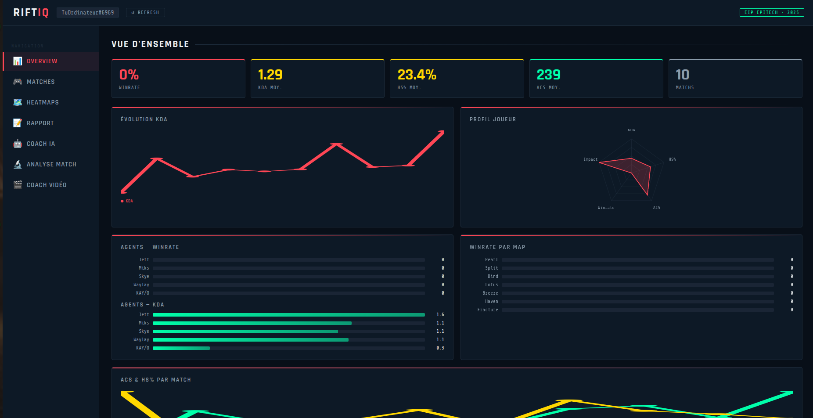
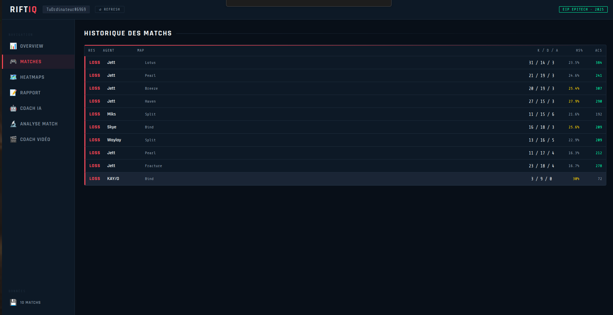
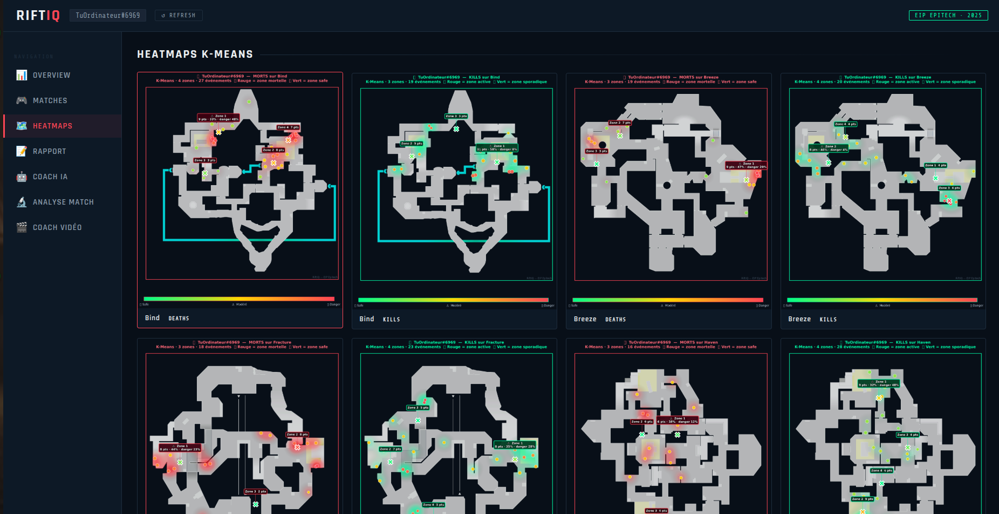
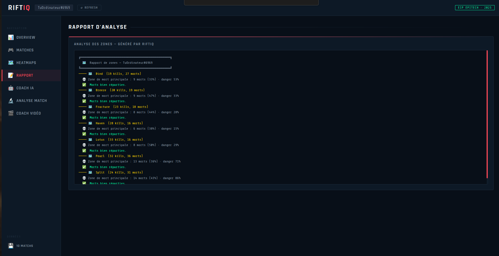
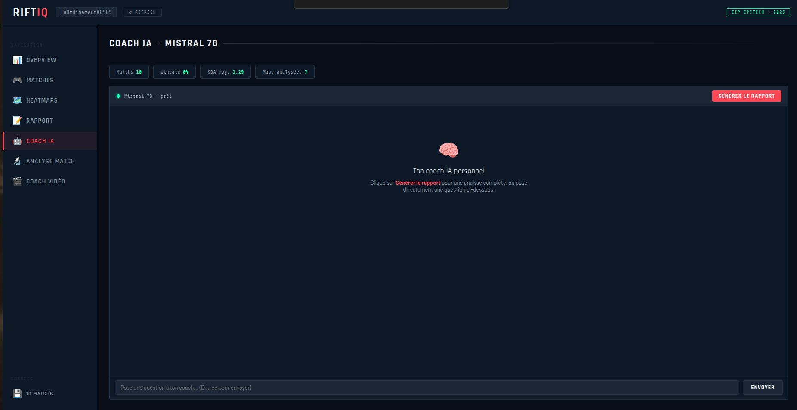
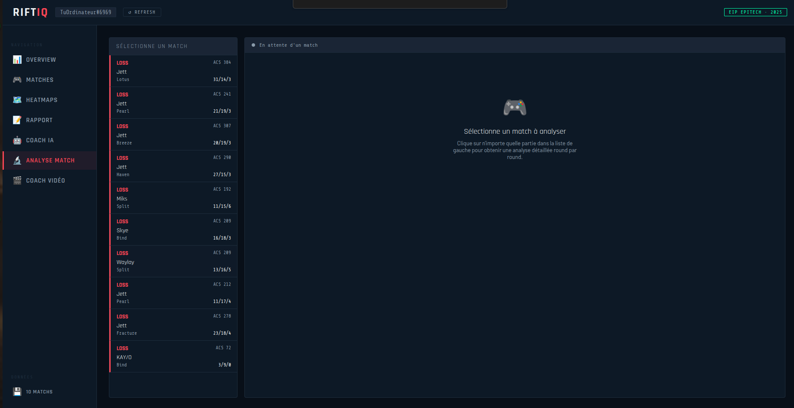
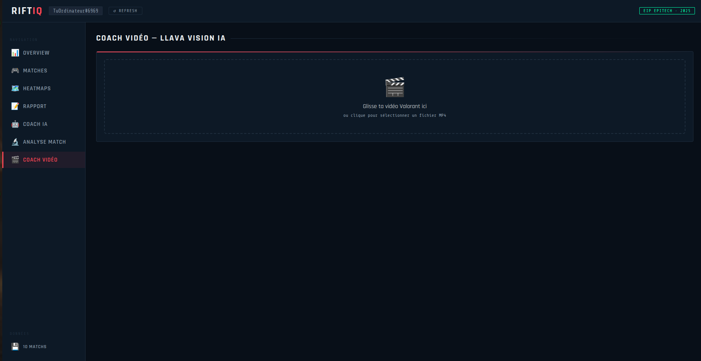

# 🎮 RiftIQ — AI-Powered Valorant Coaching

> Intelligence Artificielle appliquée à l'esport compétitif

RiftIQ analyse tes parties Valorant avec du Machine Learning (K-Means clustering), génère des heatmaps de tes zones de kills/morts, propose un coaching IA via LLM (Mistral 7B) et analyse tes vidéos de gameplay via Computer Vision (LLaVA).

---

## 📋 Prérequis système

- **OS** : Ubuntu 20.04+ / WSL2 / Debian
- **Python** : 3.10+
- **Node.js** : 20.x+
- **npm** : 9.x+
- **Git** : 2.x+
- **GPU** : Nvidia recommandé (pour Ollama)

---

## 🚀 Installation complète (from scratch)

### 1. Cloner le repo

```bash
git clone https://github.com/TON_USERNAME/RiftIQ.git
cd RiftIQ
```

### 2. Installer Node.js 20

```bash
curl -o- https://raw.githubusercontent.com/nvm-sh/nvm/v0.39.7/install.sh | bash
source ~/.bashrc
nvm install 20
nvm use 20
node --version   # v20.x.x
```

### 3. Créer l'environnement Python

```bash
sudo apt update && sudo apt install python3-venv python3-pip -y
python3 -m venv venv
source venv/bin/activate
```

### 4. Installer les dépendances Python

```bash
pip install requests pandas numpy scikit-learn matplotlib pillow scipy \
            fastapi uvicorn python-multipart httpx \
            opencv-python-headless \
            python-jose[cryptography] passlib[bcrypt]
```

### 5. Installer Ollama + modèles IA

```bash
# Installe Ollama
curl -fsSL https://ollama.ai/install.sh | sh

# Mistral 7B — coaching textuel (4.4 GB)
ollama pull mistral

# LLaVA — analyse vidéo / vision (4.7 GB)
ollama pull llava

# Vérifie
ollama list
```

### 6. Installer les dépendances du dashboard React

```bash
cd dashboard
npm install
npm install recharts@2.12.7 --legacy-peer-deps
cd ..
```

---

## 🔑 Configuration des clés API

### Riot Games API Key
1. Va sur [developer.riotgames.com](https://developer.riotgames.com)
2. Connecte-toi avec ton compte Riot
3. Génère une **Development API Key** (valable 24h)

```bash
export RIOT_API_KEY="RGAPI-xxxxxxxx-xxxx-xxxx-xxxx-xxxxxxxxxxxx"
```

### Riot RSO OAuth2 (pour l'auth avec compte Riot)
1. Va sur [developer.riotgames.com](https://developer.riotgames.com) → **Submit a Product**
2. Remplis le formulaire :
   - **App Name** : RiftIQ
   - **Description** : Plateforme de coaching IA pour joueurs Valorant — projet étudiant Epitech EIP
   - **Scopes** : `openid`, `cpid`
   - **Redirect URI** : `http://localhost:8000/auth/callback`
3. Riot te donne un `client_id` et `client_secret` (délai 1-2 semaines)

```bash
export RSO_CLIENT_ID="ton-client-id"
export RSO_CLIENT_SECRET="ton-client-secret"
export JWT_SECRET="une-clé-secrète-aléatoire-longue"
```

> ⚠️ **Pour rendre les clés permanentes :**
> ```bash
> echo 'export RIOT_API_KEY="RGAPI-..."'     >> ~/.bashrc
> echo 'export RSO_CLIENT_ID="..."'          >> ~/.bashrc
> echo 'export RSO_CLIENT_SECRET="..."'      >> ~/.bashrc
> echo 'export JWT_SECRET="..."'             >> ~/.bashrc
> source ~/.bashrc
> ```

---

## 📁 Structure du projet

```
RiftIQ/
├── riot_pipeline.py      # Collecte les données de matchs via API
├── analyze.py            # Analyse statistique des données
├── heatmap.py            # Module IA K-Means — génère les heatmaps
├── coach.py              # Coach IA global (Mistral 7B)
├── match_coach.py        # Analyse détaillée d'un match (Mistral)
├── video_coach.py        # Analyse vidéo gameplay (LLaVA)
├── api.py                # API FastAPI — sert les données au dashboard
├── data/                 # Données JSON générées (gitignore)
├── output/               # Heatmaps PNG + rapports (gitignore)
├── dashboard/            # Dashboard React + Vite
│   ├── src/
│   │   ├── App.jsx
│   │   ├── index.css
│   │   └── pages/
│   │       ├── Overview.jsx       # KPIs + graphiques
│   │       ├── Matches.jsx        # Historique des matchs
│   │       ├── Heatmaps.jsx       # Heatmaps K-Means
│   │       ├── Report.jsx         # Rapport d'analyse
│   │       ├── Coach.jsx          # Chat coach IA global
│   │       ├── MatchAnalysis.jsx  # Analyse par match
│   │       └── VideoCoach.jsx     # Coach vidéo LLaVA
│   └── package.json
├── venv/                 # Environnement Python (gitignore)
├── .gitignore
└── README.md
```

---

## 🎯 Utilisation

### Étape 1 — Récupérer tes données de match

```bash
source venv/bin/activate
python riot_pipeline.py --name "TonPseudo" --tag "EUW" --matches 20
```

### Étape 2 — Générer les heatmaps K-Means

```bash
python heatmap.py --name "TonPseudo" --tag "EUW" --matches 20
# Images PNG générées dans output/
explorer.exe output/   # WSL uniquement
```

### Étape 3 — Générer le rapport d'analyse

```bash
python analyze.py --name "TonPseudo" --tag "EUW"
```

### Étape 4 — Coach IA en ligne de commande

```bash
# Rapport complet
python coach.py --name "TonPseudo" --tag "EUW"

# Question spécifique
python coach.py --name "TonPseudo" --tag "EUW" --question "Quel est mon plus gros point faible ?"
```

### Étape 5 — Analyse vidéo

```bash
python video_coach.py --video ma_partie.mp4 --frames 8
```

### Étape 6 — Lancer le dashboard complet

**Terminal 1 — API Python :**
```bash
source venv/bin/activate
uvicorn api:app --reload --port 8000
```

**Terminal 2 — Dashboard React :**
```bash
cd dashboard
npm run dev
```

**Ouvre :** [http://localhost:5173](http://localhost:5173)

---

## 🚀 Lancement rapide (tout en une fois)

```bash
chmod +x start.sh
./start.sh
```

Contenu de `start.sh` :
```bash
#!/bin/bash
echo "🎮 Démarrage RiftIQ..."
source venv/bin/activate
uvicorn api:app --port 8000 &
echo "✅ API lancée sur http://localhost:8000"
cd dashboard && npm run dev &
echo "✅ Dashboard lancé sur http://localhost:5173"
wait
```

---

## 🧠 Modules IA

### Module 1 — K-Means Clustering (heatmap.py)
- Détection automatique du K optimal (méthode du coude)
- KDE gaussien masqué par la géographie de la map
- Coloration par niveau de danger (vert → rouge)
- Paramètres officiels valorant-api.com pour 12 maps

### Module 2 — Coach LLM (coach.py + match_coach.py)
- **Mistral 7B** via Ollama (100% local, gratuit)
- Prompt enrichi : stats + heatmaps + économie + round par round
- Streaming token par token dans le dashboard
- Chat interactif avec mémoire du contexte

### Module 3 — Vision IA (video_coach.py)
- **LLaVA** via Ollama pour l'analyse d'images
- Extraction de frames clés avec OpenCV
- Analyse du positionnement sur site
- Extraction et analyse de la minimap (coin bas-gauche)
- Synthèse par Mistral

### Module 4 — Auth RSO (en cours)
- OAuth2 officiel Riot Games
- Connexion avec compte Riot
- Sauvegarde des profils en SQLite

---

## 🗺️ Maps supportées

Ascent, Bind, Split, Haven, Fracture, Pearl, Icebox, Breeze, Lotus, Sunset, Abyss, Corrode

---

## 📸 Screenshots

### Vue d'ensemble — KPIs + Graphiques


### Historique des matchs


### Heatmaps — KMeans


### Rapport — Compte rendu


### Coach IA — Mistral 7B


### Analyse Match — Round par round


### Coach Vidéo — LLaVA Vision IA


---

---

## 🔧 Architecture technique

```
┌─────────────────┐     ┌──────────────────┐     ┌─────────────────┐
│   Riot API      │────▶│  riot_pipeline   │────▶│   data/*.json   │
│   Henrik API    │     │   (Python)       │     └────────┬────────┘
└─────────────────┘     └──────────────────┘              │
                                                           ▼
                        ┌──────────────────┐     ┌─────────────────┐
                        │   heatmap.py     │────▶│  output/*.png   │
                        │  K-Means + KDE   │     └────────┬────────┘
                        └──────────────────┘              │
                                                           ▼
┌─────────────────┐     ┌──────────────────┐     ┌─────────────────┐
│  Dashboard      │◀────│    api.py        │◀────│  Ollama         │
│  React + Vite   │     │    FastAPI       │     │  Mistral + LLaVA│
│  :5173          │     │    :8000         │     └─────────────────┘
└─────────────────┘     └──────────────────┘
```

---

## ❗ Dépannage

### Clé Riot expire toutes les 24h
Régénère sur [developer.riotgames.com](https://developer.riotgames.com) et réexporte.

### Port 8000 déjà utilisé
```bash
pkill -9 -f uvicorn
uvicorn api:app --reload --port 8000
```

### npm install échoue
```bash
npm install --legacy-peer-deps
```

### Recharts incompatible React 19
```bash
npm install recharts@2.12.7 --legacy-peer-deps
```

### Rate limit Henrik (429)
Le pipeline attend automatiquement 12 secondes. Si ça persiste, attends 1 minute.

### Ollama ne répond pas
```bash
# Vérifie qu'Ollama tourne
ollama list
# Si erreur, démarre manuellement
ollama serve
```

### LLaVA analyse vidéo lente
Normal sans GPU — avec Nvidia c'est ~2-3 min pour 8 frames.
Réduis le nombre de frames : `--frames 4`

---

## 📊 Roadmap EIP

- [x] Pipeline données Riot + Henrik
- [x] Module K-Means heatmap (12 maps)
- [x] API FastAPI
- [x] Dashboard React (6 pages)
- [x] Coach LLM Mistral 7B
- [x] Analyse détaillée par match
- [x] Coach vidéo LLaVA (Computer Vision)
- [ ] Auth RSO Riot OAuth2
- [ ] Profils multi-joueurs SQLite
- [ ] Scoring économique (module IA)
- [ ] Déploiement Docker + VPS
- [ ] Application mobile React Native

---

## ⚖️ Mentions légales

Ce projet utilise les APIs Riot Games et Henrik Dev.
Il n'est pas approuvé par Riot Games et ne reflète pas leurs opinions.
Riot Games, VALORANT et tous les éléments associés sont des marques déposées de Riot Games, Inc.

---

## 👥 Équipe EIP Epitech 2025

**RiftIQ** — Coaching IA pour joueurs compétitifs Valorant

---